# C# Geometry

## Build Status

## Getting Started
The library is available as a NuGet package for any .Net implementation that supports the .Net Standard 2.0. Visit the [Packages](https://github.com/qkmaxware/Geometry/packages) page for downloads.

## Primitive Geometry
Geometry in this library is modeled as a collection of triangular faces whose vertices are points in 3d space. There are some handy utility classes which can be used to generate specific primitive geometric shapes as described below. 

| Name | Shape | Image |
|------|-------|-------|
| Plane | Flat planar face in the XY plane | 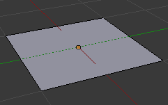 |
| Cube | 6 sided cube | 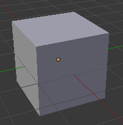 |
| Cylinder | Solid cylinder with configurable radii | 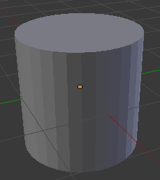 |
| Tube | Hollowed out cylinder with an inner and outer radius | 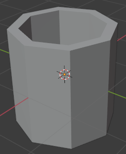 |
| Capsule | Cylinder capped with two hemispheres | 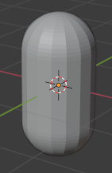 |
| Cone | Cone with a given radius | 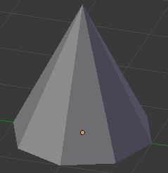 |
| Sphere | UV sphere | 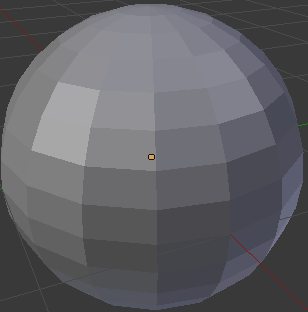 |
| Hemisphere | Half of a sphere | 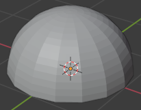 |
| Torus | Torus with configurable radii | 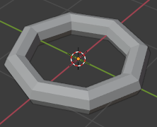 |
| Frustum | Pyramidal Frustums | 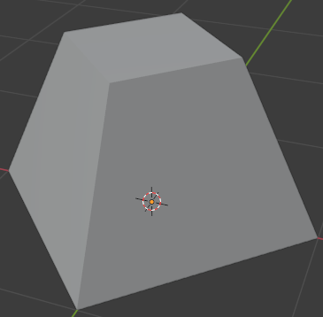 |
| Nosecone | Varieties of aerodynamic nosecones | 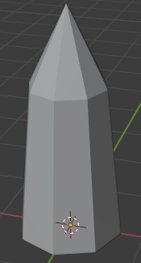 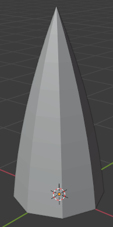|

## Transformations for Building Geometries
| Name | Effect | Result |
|------|--------|--------|
| Difference | Subtract one solid from another | 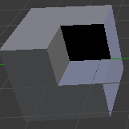 |
| Union | Combine 2 solids into a single solid | 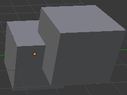 |
| Intersection | Form a new block from where two blocks overlap | 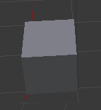 |

## Importing and Exporting Geometries
The core library supports importing and exporting geometry from several different 3d model file formats. All classes related to importing and exporting can be found within the `Qkmaxware.Geometry.IO` namespace.

| Format | Extension | Import Binary | Import Ascii | Export Binary | Export Ascii |
|--------|-----------|--------|--------|--------|--------|
| Stereolithography CAD | .stl | &#9745; | &#9745; | &#9745; | &#9745; |
| Wavefront Object | .obj | &#9744; | &#9745; | &#9744; | &#9745; |
| Extensible 3D Graphics | .x3d | &#9744; | &#9744; | &#9744; | &#9745; |

## Made With
- [.Net Standard](https://docs.microsoft.com/en-us/dotnet/standard/net-standard)

## License
See [License](LICENSE.md) for license details.